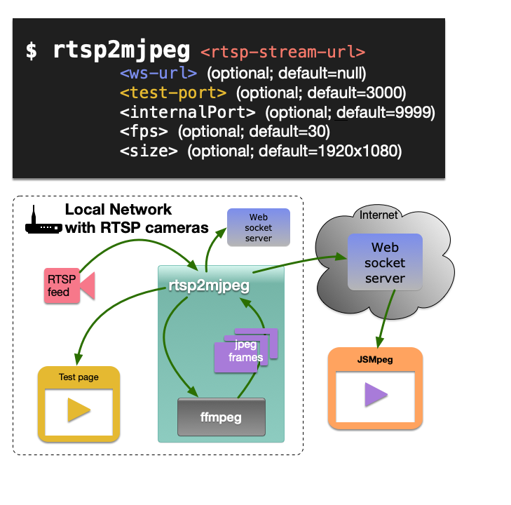

# rtsp2mjpeg

This is a simple RTSP to MJPEG proxy server. It can be used to convert an RTSP stream to MJPEG stream. The stream works with [jsmpeg](https://jsmpeg.com/).



## Installation

```bash
[sudo] npm install -g rtsp2mjpeg
```

Install ffmpeg: https://ffmpeg.org/download.html


## Usage

```bash

 rtsp2mjpeg <rtsp-stream-url> \
           <ws-url> (optional; default=null) \
           <test-port> (optional; default=3000) \
           <internalPort> (optional; default=9999) \ 
           <fps> (optional; default=30) \
           <size> (optional; default=1920x1080)

```

## Example

```bash

rtsp2mjpeg rtsp://192.168.0.247:8554/live \
           ws://localhost:3000 \
           3000 \
           9999 \
           30 \
           1920x1080

```

## Dependencies

- ffmpeg
- nodejs
- npm
- forever-monitor

